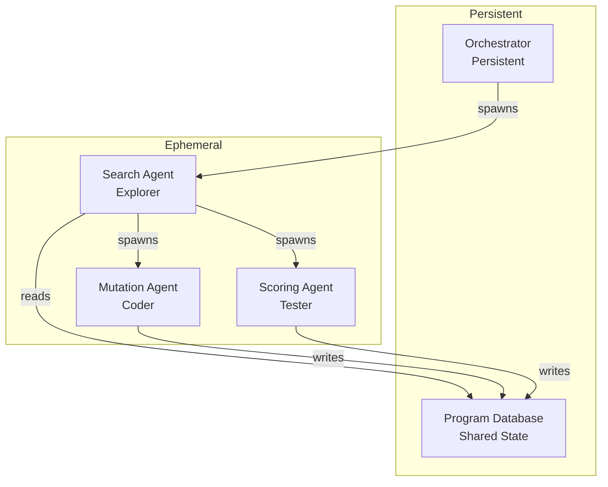
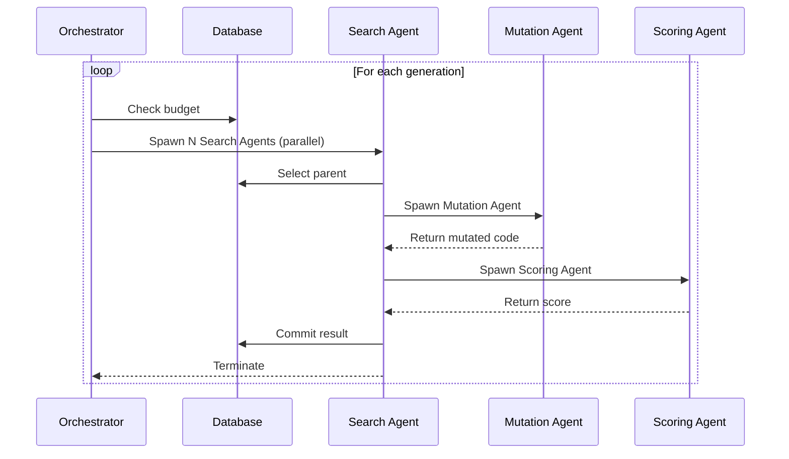

# Agentic AlphaEvolve Refactoring Plan

## Overview

This document outlines the refactoring of AlphaEvolve from a monolithic controller-based architecture to a decentralized multi-agent system as specified in `instructions/agents.md`.

## Current Architecture Issues

1. **Over-abstraction**: Too many classes with overlapping responsibilities
2. **Monolithic controller**: `AlphaEvolveAgent` and `AsyncController` do too much
3. **Complex async implementation**: `AsyncController` with queues, workers, and complex state management
4. **No clear separation of concerns**: Evaluation, mutation, and selection are tightly coupled

## New Agentic Architecture

### Core Components



### Module Responsibilities

| Module | Type | Responsibility |
|--------|------|----------------|
| `database.py` | Persistent | Store programs, scores, lineage (shared state) |
| `orchestrator.py` | Persistent | Monitor budget, spawn Search Agents |
| `search_agent.py` | Ephemeral | Selection, context construction, delegation, commit |
| `mutation_agent.py` | Ephemeral | LLM querying, diff generation, patching, syntax check |
| `scoring_agent.py` | Ephemeral | Sandbox creation, cascade evaluation, metrics |
| `llm_client.py` | Utility | Simple LLM wrapper |
| `config.py` | Configuration | Simplified configuration |
| `cli.py` | Utility | Command-line interface |
| `main.py` | Entry | Main entry point |

## Detailed Module Specifications

### 1. `database.py` - Program Database (Shared State)

**Purpose**: Simple storage for programs, scores, and lineage accessible by all agents.

**Key Functions**:
- `add_program(code, fitness, metadata)` - Add a program
- `select_parent()` - Select parent using MAP-Elites or Island Model
- `sample_context(n)` - Sample programs for context
- `get_best()` - Get best program
- `get_stats()` - Get population statistics

**Data Structures**:
```python
@dataclass
class Program:
    code: str
    fitness: float
    metadata: dict
    generation: int
    parent_id: Optional[int]  # Lineage tracking
```

### 2. `orchestrator.py` - Master Orchestrator (Persistent)

**Purpose**: Monitors budget and spawns Search Agents. Does NOT execute code or query LLMs.

**Key Functions**:
- `run(evaluator, budget)` - Main loop, spawns Search Agents in parallel
- `spawn_search_agent()` - Create and run a Search Agent
- `check_budget()` - Check if budget exhausted

**Workflow**:


### 3. `search_agent.py` - Search Agent (Ephemeral)

**Purpose**: Runs for ONE evolutionary step, then terminates.

**Key Functions**:
- `run()` - Execute one search cycle
- `select_parent()` - Query database for parent
- `build_prompt()` - Construct prompt with context
- `delegate_mutation()` - Spawn Mutation Agent
- `delegate_scoring()` - Spawn Scoring Agent
- `commit()` - Save result to database

**Lifecycle**:
1. Created by Orchestrator
2. Reads DB, selects Parent Code
3. Compiles Context Prompt
4. Spawns Mutation Agent → gets Child Code
5. Spawns Scoring Agent → gets Score Dict
6. Saves Child Code + Score to DB
7. Terminates

### 4. `mutation_agent.py` - Mutation Agent (Ephemeral)

**Purpose**: Generate mutated code using LLM.

**Key Functions**:
- `run(parent_code, prompt)` - Generate mutation
- `query_llm()` - Query LLM ensemble
- `generate_diff()` - Request SEARCH/REPLACE format
- `apply_diff()` - Apply patch to parent code
- `check_syntax()` - Validate Python syntax

**Lifecycle**:
1. Spawned by Search Agent
2. Calls LLM → gets Diffs
3. Applies Patch → produces Child Program
4. Syntax Check (retry if invalid)
5. Returns Child Code
6. Terminates

### 5. `scoring_agent.py` - Scoring Agent (Ephemeral)

**Purpose**: Evaluate code and return metrics.

**Key Functions**:
- `run(code)` - Evaluate code
- `create_sandbox()` - Set up isolated environment
- `evaluate_cascade()` - Run cascade evaluation (Phase 1 → Phase 2)
- `grade_quality()` - Optional LLM grading for qualitative metrics
- `return_metrics()` - Return dictionary of scalars

**Lifecycle**:
1. Spawned by Search Agent
2. Runs evaluate() cascade
3. Returns Score Dict
4. Terminates

### 6. `llm_client.py` - LLM Client (Utility)

**Purpose**: Simple wrapper for LLM interactions.

**Key Functions**:
- `generate(prompt)` - Generate text
- `generate_diff(original_code, prompt)` - Generate SEARCH/REPLACE diff
- `parse_diff(response)` - Parse diff format
- `apply_diff(original_code, search_text, replace_text)` - Apply diff

### 7. `config.py` - Configuration

**Simplified Configuration**:
```python
@dataclass
class Config:
    # LLM settings
    model_id: str
    max_tokens: int = 512
    temperature: float = 0.7
    
    # Search settings
    population_size: int = 5
    num_generations: int = 50
    parallel_slots: int = 50  # Max parallel Search Agents
    
    # Database settings
    selection_strategy: str = "map_elites"
    diversity_weight: float = 0.3
    
    # Evaluation settings
    use_cascade: bool = True
    fast_eval_ratio: float = 0.3
```

## Files to Remove

After implementing the new architecture, these files will be obsolete:
- `agent.py` - Replaced by orchestrator.py and search_agent.py
- `async_controller.py` - Replaced by orchestrator.py
- `evaluation_engine.py` - Replaced by scoring_agent.py
- `prompt_sampler.py` - Integrated into search_agent.py
- `llm_ensemble.py` - Replaced by llm_client.py

## Files to Keep (Minimal Changes)

- `program_database.py` → Refactor into `database.py`
- `program_validator.py` - Keep as-is (used by mutation_agent.py)
- `search.py` - Keep evaluator classes
- `task_loader.py` - Keep as-is
- `utils.py` - Keep as-is
- `secrets.py` - Keep as-is
- `examples.py` - Keep as-is

## Implementation Order

1. Create `database.py` - Simplified program database
2. Create `llm_client.py` - Simple LLM wrapper
3. Create `mutation_agent.py` - Mutation agent
4. Create `scoring_agent.py` - Scoring agent
5. Create `search_agent.py` - Search agent
6. Create `orchestrator.py` - Main orchestrator
7. Update `config.py` - Simplified config
8. Update `main.py` - Use new architecture
9. Update `cli.py` - Update CLI arguments
10. Remove obsolete files
11. Test implementation

## Advantages of This Design

1. **Scalability**: Search Agents can be deployed across different machines
2. **Fault Tolerance**: If a Scoring Agent crashes, only that instance dies
3. **Resource Efficiency**: Agents consume resources only when active
4. **Clear Separation**: Each agent has a single, well-defined responsibility
5. **Simpler Code**: Less abstraction, more straightforward implementation
